# Liri Bot
## Purpose
A simple command line app that takes 3 (technically 4) commands to search various 3rd party web-based APIs.
## Technical Overview 
The application parses the command line arguments after node and liri.js, using the combination of the command and the user query to initate a search on the appropriate API with the user's search term. 
## Usage 
Easy peasy. See this video: 
https://drive.google.com/file/d/1TSSN18-mWCdNbew2SxoUuhStr9l4gUzs/view

OR 

### Liri - concert-this 
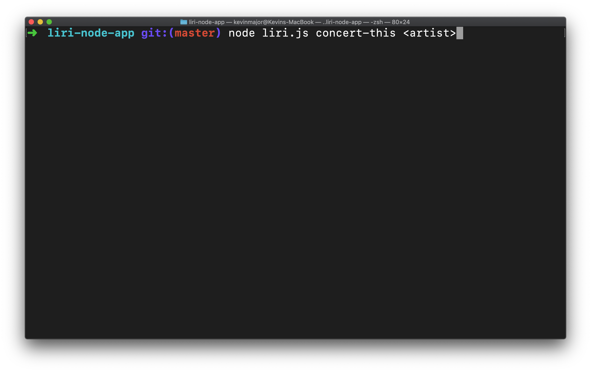
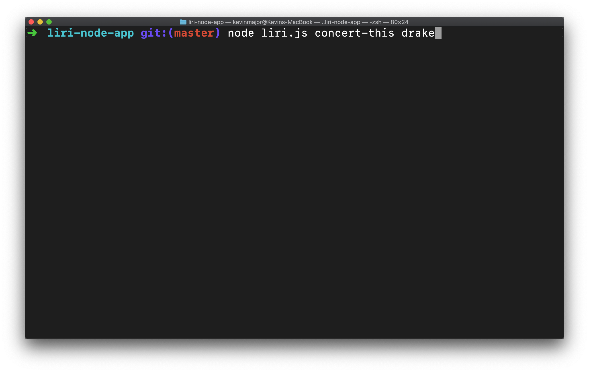
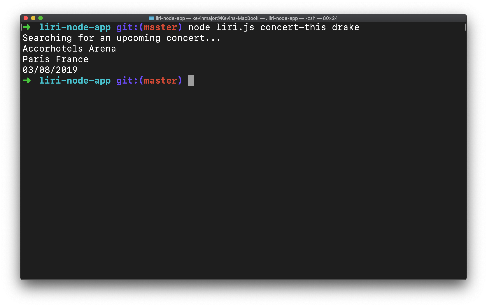
### Liri - movie-this
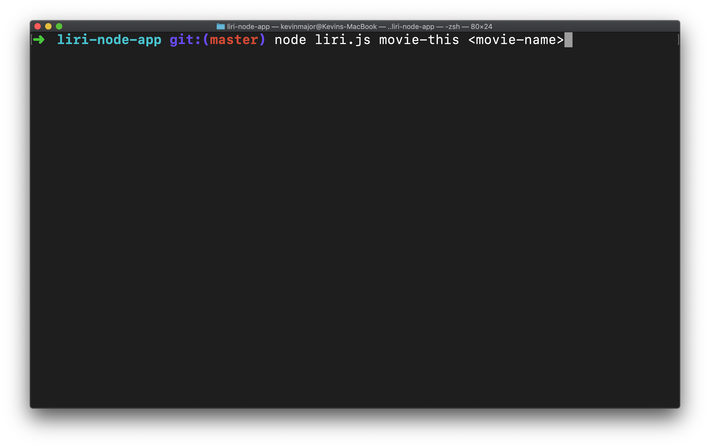
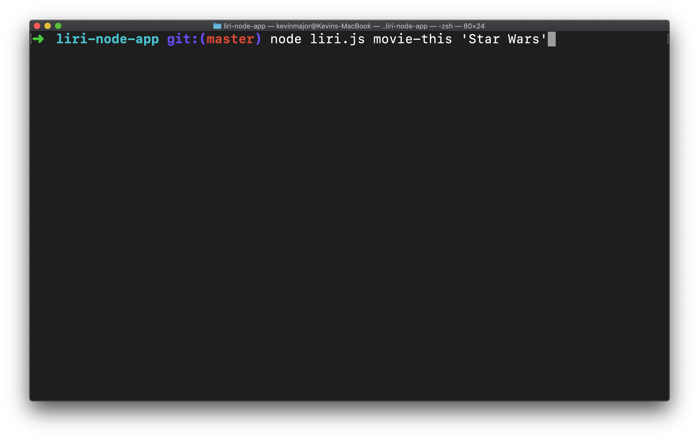
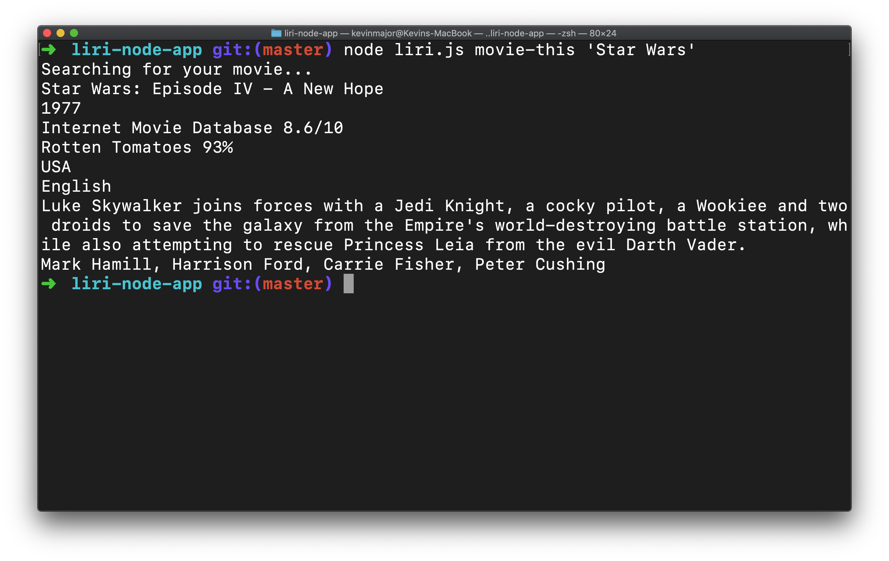
### Liri - spotify-this

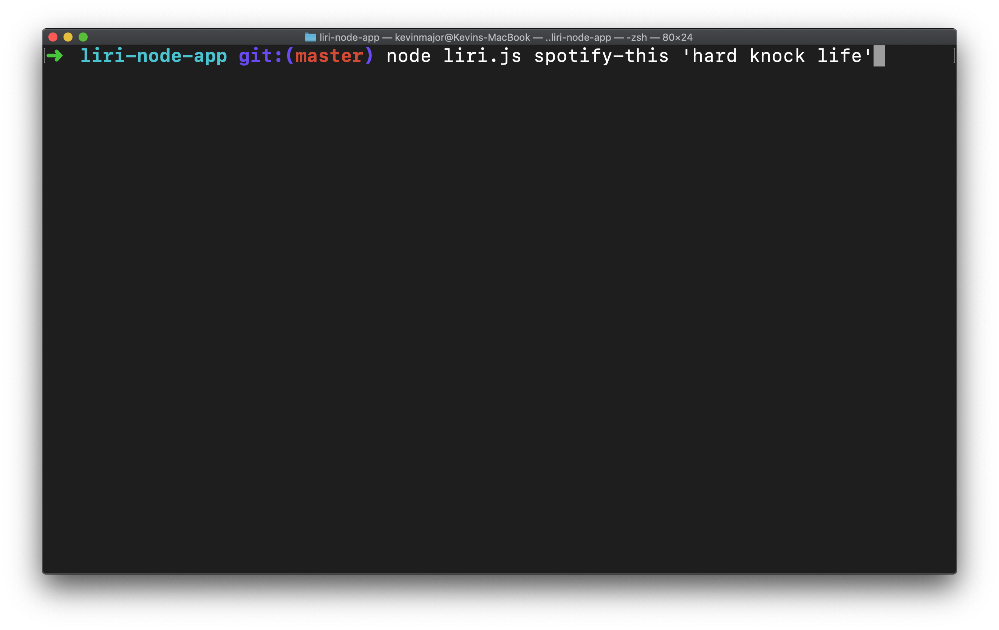
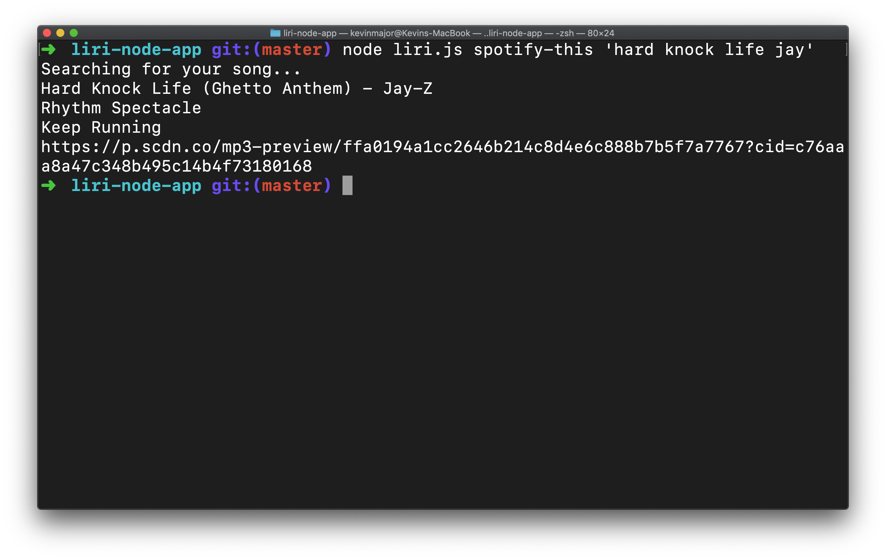
### Liri - simon-says 
#### Purpose 
Accesses a file, random.txt stored in project folder that contains a Liri command followed by a user query. Command and query separated by comma. 

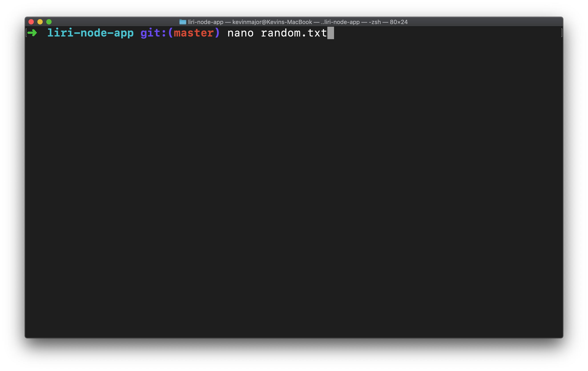
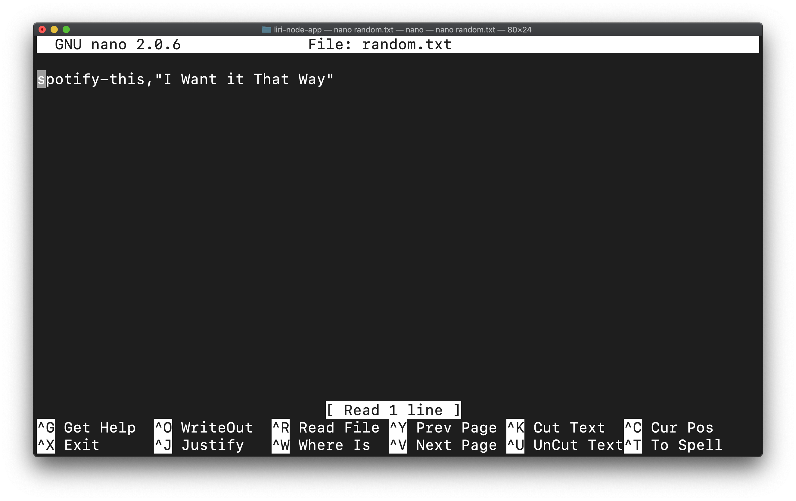
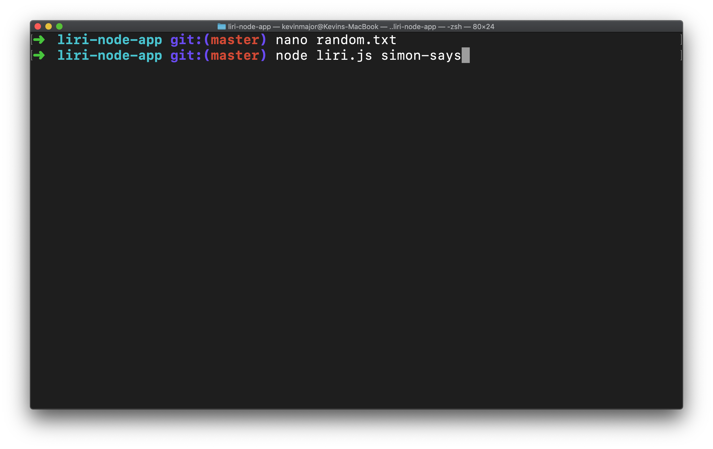
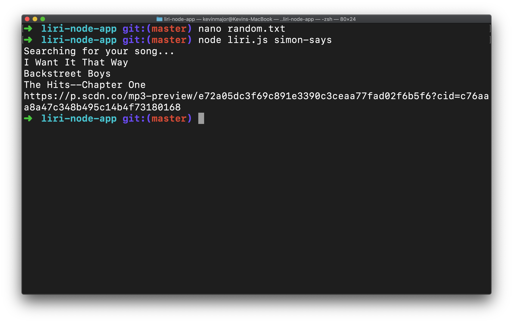

